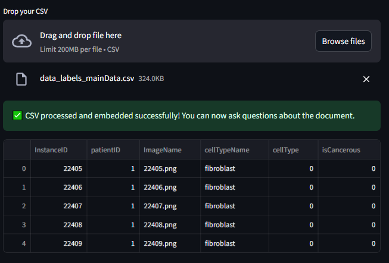
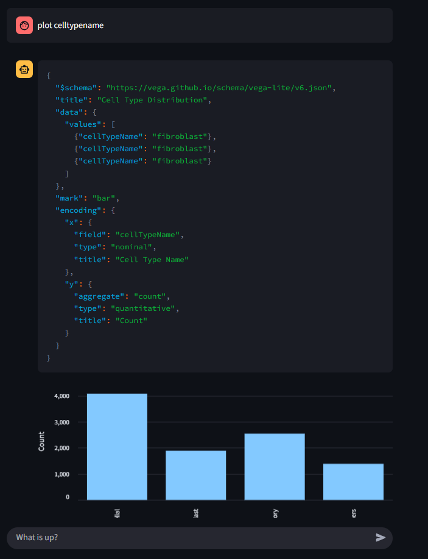

# DashboardLLM

It generates charts based on the data using Vega-Lite JSON specifications, ensuring safe and efficient visualization without any malicious code execution.




## Key Features

-   **CSV Processing:** Reads and processes data from uploaded CSV files to generate insights.
-   **Chart Generation:** Creates interactive charts using Vega-Lite JSON specifications, ensuring secure and reliable visualization.
-   **Retrieval-Augmented Generation (RAG):** Employs a vector database (ChromaDB) to find the most relevant data chunks to answer user queries.
-   **Local LLMs:** Powered by local language models via Ollama, ensuring privacy and control over the models used.

## Tech Stack

-   **Backend & Orchestration:** Python, LangChain
-   **Frontend:** Streamlit
-   **LLM Serving:** Ollama
-   **Models:**
    -   **Generation:** `Qwen` (or any other powerful chat model)
    -   **Embeddings:** `granite-embedding:latest`
-   **Vector Database:** ChromaDB
-   **CSV Processing:** Pandas

## How It Works

1. **CSV Upload:** Users upload a CSV file containing structured data.
2. **Context Retrieval:** Relevant data chunks are retrieved using ChromaDB.
3. **Chart Generation:** The system generates Vega-Lite JSON specifications based on the data and renders interactive charts.
4. **Interactive Chat Interface:** Users interact with the chatbot via a Streamlit-based UI.

## Getting Started

1. Clone the repository:
    ```bash
    git clone https://github.com/Aeets6/dashboard-LLM.git
    cd dashboard-LLM
    ```

2. Install dependencies:
    ```bash
    pip install -r requirements.txt
    ```

3. Run the application:
    ```bash
    streamlit run main.py
    ```

4. Upload a CSV file and start interacting with the chatbot.

## Security

DashboardLLM ensures safe operation by:
- Using Vega-Lite JSON specifications for chart generation, eliminating the risk of malicious code execution.
- Employing local language models for privacy and control.